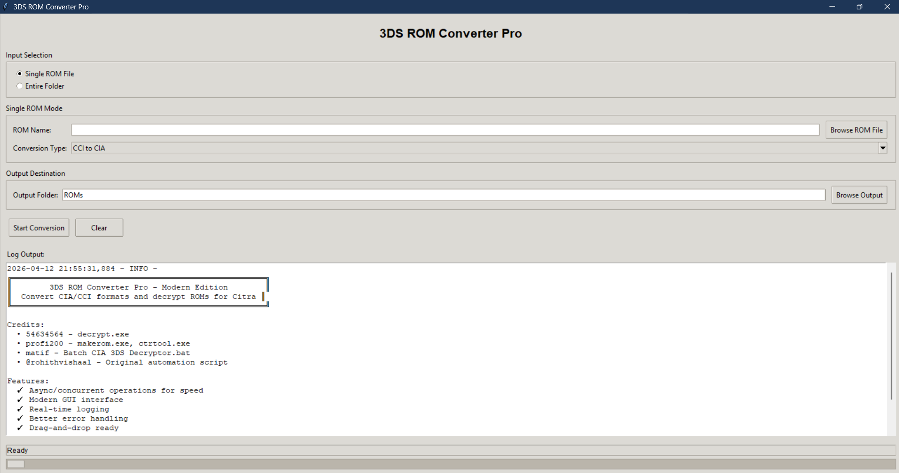

You might also be interested in [Hotcorners for windows](https://github.com/rohithvishaal/hotcorners-for-windows) (triggers actions you set when your mouse cursor reaches the corners of your screen)
# 3DS ROM Converter Pro - Modern Edition

A modern, async-based GUI tool to convert 3DS ROM formats (CIA/CCI) and decrypt them for use with the Citra emulator.

## Features ✨

### Improvements Over Original
- **🚀 Async Operations**: Uses Python's asyncio for concurrent processing - faster conversions
- **💻 Modern GUI**: Professional graphical interface instead of text-based menu
- **📊 Real-time Logging**: See what's happening in real-time in the GUI
- **🔧 Better Error Handling**: Detailed error messages and recovery
- **⚙️ Object-Oriented Code**: Clean, maintainable architecture
- **📝 Type Hints**: Full type annotations for better IDE support
- **🎯 Non-Blocking Operations**: UI stays responsive during conversions

### Supported Operations
1. **CCI to CIA**: Convert CCI files to CIA format
2. **CIA to CCI**: Convert CIA files to CCI format
3. **CCI Decrypt**: Decrypt all CCI files in batch
4. **CIA to Decrypted CCI**: One-command conversion and decryption

## Requirements

- **Python**: 3.9 or higher
- **Operating System**: Windows (due to batch script dependencies)
- **External Tools** (must be in the same folder):
  - `makerom-x86_64.exe` - ROM conversion tool
  - `Batch CIA 3DS Decryptor.bat` - Decryption batch script
  - `decrypt.exe` - (used by the batch script)

## Installation

### Step 1: Install Python
Download and install Python 3.10+ from [python.org](https://python.org)
- ✅ Make sure to check "Add Python to PATH" during installation

### Step 2: Verify Python Installation
```powershell
python --version
```

### Step 3: Install Dependencies (Optional)
The GUI version requires no external dependencies - tkinter is built-in!

### Step 4: Ensure Required Tools Are Present
Make sure these files are in the same directory as the script:
- `makerom-x86_64.exe`
- `Batch CIA 3DS Decryptor.bat`
- `decrypt.exe`

## Usage

### Running the GUI Version

```powershell
python 3ds_converter_gui.py
```

Or double-click the file `Launch_GUI.bat`in Windows Explorer.

### How to Use

1. **Select Conversion Type**: Choose from the dropdown:
   - CCI to CIA
   - CIA to CCI
   - CCI Decrypt
   - CIA to Decrypted CCI

2. **Enter ROM Name**: Type the ROM filename (with or without extension)
   - Example: `game_name` or `game_name.cia` or select using the browse rom button

3. **Click "Start Conversion"**: The conversion will begin
   - Watch the log output for progress
   - Status bar shows real-time updates

4. **Check the ROMs folder**: Your converted files appear here or you have an option to select the output folder in the GUI

### Tips

- **File Names**: Avoid spaces in filenames for best compatibility
- **CCI Decrypt**: You can decrypt multiple CCI files at once - just place them all in the ROMs folder
- **Check Encryption**: If unsure whether a ROM is encrypted, try loading it in Citra first
- **Browse Folder**: Click "Browse ROM Folder" to change where ROMs are stored
- **Log Details**: Check the log window for detailed error messages if something goes wrong

## File Structure

```
3ds-converters/
├── 3ds_converter_gui.py          # Main GUI application (NEW)
├── 3ds.py                         # Original CLI version (legacy)
├── Batch CIA 3DS Decryptor.bat    # Required batch script
├── 3DS_Converter.bat              # Legacy batch converter
├── makerom-x86_64.exe             # Required tool
├── decrypt.exe                    # Required tool
├── requirements.txt               # Python dependencies
└── ROMs/                          # Output folder (auto-created)
    ├── converted_game.cia
    ├── decrypted_game.3ds
    └── ...
```

## Advanced Usage

### Using the CLI Version
If you prefer the command-line interface:
```powershell
python 3ds.py
```

### Logging

All operations are logged to:
- **GUI**: Displayed in real-time in the log window
- **File**: Logs are sent to Python's logging system

## Troubleshooting

### "makerom-x86_64.exe not found"
- **Solution**: Ensure `makerom-x86_64.exe` is in the same folder as the script

### "Batch CIA 3DS Decryptor.bat not found"
- **Solution**: Ensure the batch file is in the same folder as the script

### Conversion seems frozen
- **Note**: This is normal - conversions can take several minutes. Watch the log for progress.
- The GUI remains responsive even during conversion

### ROM not found error
- **Check**: Ensure the ROM file is in the `ROMs` folder
- **Check**: File extension is exactly `.cia` or `.cci`
- **Tip**: Try running "Browse ROM Folder" to verify the location

### "Python is not recognized"
- **Solution**: Python wasn't added to PATH during installation
- **Workaround**: Right-click the Python file → Open with → Python

## Credits

**Original Scripts & Tools**:
- **54634564** - decrypt.exe
- **profi200** - makerom.exe, ctrtool.exe
- **matif** - Batch CIA 3DS Decryptor.bat
- **@rohithvishaal** - Original automation script

